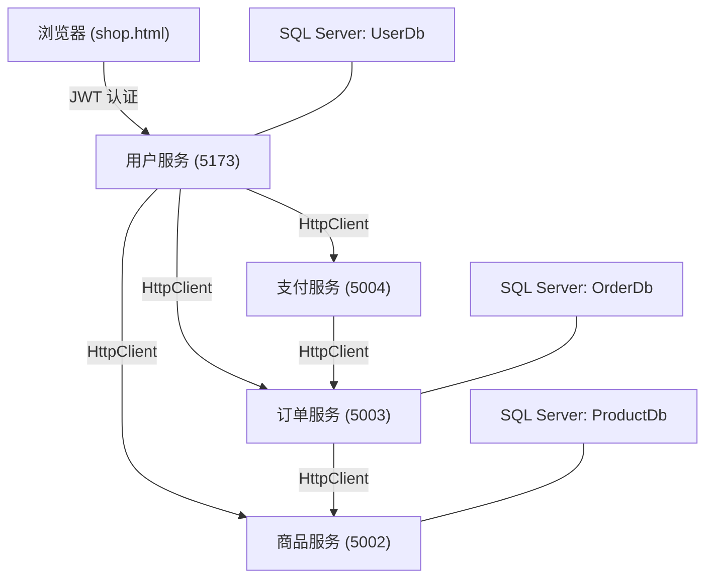

\# 🛒 微服务电商系统（EShop.Microservices）

一个基于 \*\*.NET 9\*\* 的微服务电商 Demo，包含用户、商品、订单、支付四个独立服务，完整覆盖电商核心业务流程。  

所有数据持久化到 \*\*SQL Server\*\*，前端提供一个简易 HTML 页面，可直接与后端 API 交互。

\---

\## 系统架构

## 系统架构

```mermaid
graph TD
    Browser["浏览器 (shop.html)"] -->|JWT 认证| UserService["用户服务 (5173)"]
    UserService -->|HttpClient| ProductService["商品服务 (5002)"]
    UserService -->|HttpClient| OrderService["订单服务 (5003)"]
    UserService -->|HttpClient| PaymentService["支付服务 (5004)"]
    PaymentService -->|HttpClient| OrderService
    OrderService -->|HttpClient| ProductService

    UserDB["SQL Server: UserDb"] --- UserService
    ProductDB["SQL Server: ProductDb"] --- ProductService
    OrderDB["SQL Server: OrderDb"] --- OrderService
```